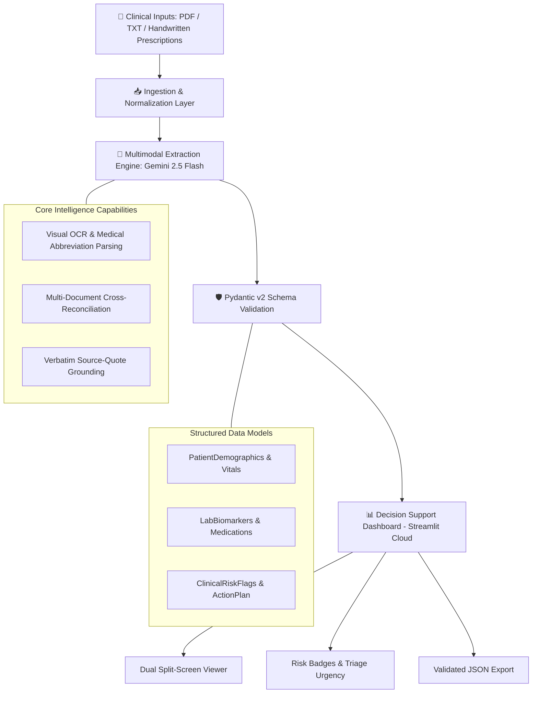

# 🩺 Clinical Document Intelligence Hub

An AI-powered multimodal clinical decision support engine designed to ingest unstructured medical records, perform native visual OCR on handwritten prescriptions, cross-reconcile multi-file clinical encounters, and output strictly validated, risk-stratified patient intelligence.

---

## 🌟 Key Capabilities

- **Multimodal Document Intake:** Ingests digital PDFs, plain text records, and scanned/handwritten physician prescriptions (.png, .jpg, .jpeg).
- **Cross-Document Clinical Reconciliation:** Synthesizes disparate files simultaneously—linking abnormal biomarkers from a typed lab report with active medications on a handwritten prescription into a single unified patient record.
- **Native Visual OCR:** Employs Gemini 2.5 Flash multimodal vision capabilities to parse physician handwriting, abbreviations, and clinical shorthand without external OCR dependencies.
- **Strict Schema Enforcement:** Constrains extractions to Pydantic v2 data models with confidence scoring (0.0 to 1.0) and verbatim source-quote grounding to mitigate hallucinations.
- **Real-Time Risk Stratification & Triage:** Automatically assigns urgency levels (ROUTINE, MODERATE, HIGH, CRITICAL) with clinical rationale and prioritized action plans.
- **Interactive Triage UI:** Responsive Streamlit dashboard featuring side-by-side raw vs. parsed views, auto-collapsing control panels, preloaded clinical scenarios, and JSON export.

---

## 🏗️ System Architecture

```text
                +-------------------------------------------------------------+
                |        Clinical Inputs (PDF / TXT / Handwritten Scans)      |
                +-------------------------------------------------------------+
                                            |
                                            v
                +-------------------------------------------------------------+
                |               Ingestion & Normalization Layer               |
                +-------------------------------------------------------------+
                                            |
                                            v
                +-------------------------------------------------------------+
                |      Multimodal Extraction Engine (Gemini 2.5 Flash)        |
                |  - Visual OCR & Clinical Abbreviation Resolution            |
                |  - Multi-Document Context Fusion & Cross-Reconciliation     |
                |  - Grounded Citation & Source Extraction                    |
                +-------------------------------------------------------------+
                                            |
                                            v
                +-------------------------------------------------------------+
                |              Pydantic v2 Schema Validation                  |
                |  - PatientDemographics & VitalSigns                         |
                |  - LabBiomarkers & MedicationItem                           |
                |  - ClinicalRiskFlags & ActionItem                           |
                +-------------------------------------------------------------+
                                            |
                                            v
                +-------------------------------------------------------------+
                |               Decision Support Dashboard                    |
                |  - Split-Screen Dual Viewer (Raw Document vs Extracted Cards)|
                |  - Urgency Badges & Interactive Data Tables                 |
                |  - Validated JSON Report Export                             |
                +-------------------------------------------------------------+
```

## 🚀 Quickstart & Local Setup

### 1. Prerequisites
- Python 3.10+
- Google AI Studio API Key (GEMINI_API_KEY)

### 2. Installation
```text
git clone https://github.com/Farzzn/clinical-intelligence-hub.git
cd clinical-intelligence-hub
```

#### Create and activate virtual environment
```text
python -m venv venv
.\venv\Scripts\activate  ( For Windows )
source venv/bin/activate ( For Mac / Linux)
```

#### Install dependencies
```text
pip install -r requirements.txt
```


### 3. Environment Configuration

Create a .env file in the root directory:

GEMINI_API_KEY="your-google-ai-studio-api-key"

### 4. Run Application
```text
streamlit run app.py
```
Open http://localhost:8501 in your browser.

---

## 🧪 Input & Output Example

### Input (Multi-Document Encounter)
- Document 1 (Lab Report PDF): Serum Potassium: 6.7 mEq/L [CRITICAL HIGH], BUN: 58 mg/dL, Creatinine: 3.4 mg/dL
- Document 2 (Scanned Rx Image): Spironolactone 25mg PO daily, Losartan 50mg PO daily

### Extracted Intelligence (Summary JSON)

```text
{
  "document_type": "Emergency Lab Alert & Medication Review",
  "overall_urgency": "CRITICAL",
  "confidence_score": 0.98,
  "executive_summary": "Patient presents with critical hyperkalemia (6.7 mEq/L) and acute renal impairment while actively prescribed potassium-sparing agents. High immediate risk for lethal cardiac arrhythmias.",
  "demographics": {
    "name": "Maria Gonzales",
    "age": 54,
    "gender": "Female",
    "patient_id": "110934"
  },
  "risk_flags": [
    {
      "flag_title": "Severe Hyperkalemia Risk",
      "severity": "CRITICAL",
      "rationale": "Serum Potassium of 6.7 mEq/L compounded by active Spironolactone regimen presents severe risk of ventricular fibrillation.",
      "source_quote": "Serum Potassium: 6.7 mEq/L [CRITICAL HIGH]"
    }
  ],
  "recommended_actions": [
    {
      "priority": 1,
      "action": "Immediate 12-lead ECG and administration of IV Calcium Gluconate and Insulin-Dextrose.",
      "assigned_role": "Attending Physician"
    },
    {
      "priority": 2,
      "action": "Discontinue Spironolactone and Losartan immediately.",
      "assigned_role": "Clinical Pharmacist"
    }
  ]
}
```
---

## 🔮 Future Roadmap

1. FHIR / HL7 EHR Standards Integration: Bidirectional data mapping into hospital EHR endpoints (Epic / Cerner).
2. On-Device PHI / HIPAA De-Identification: Localized name and identifier scrubbing prior to cloud inference.
3. Human-in-the-Loop (HITL) Sign-Off: Clinician verification audit log before committing records to downstream hospital systems.

---

## 📄 Attribution & Evaluation Context
Developed as part of the Firstsource Forward Deployed Engineer – Agentic AI Proof of Concept evaluation.


## 🏗️ System Architecture

